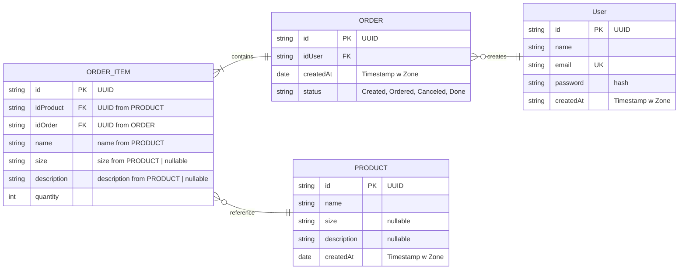

# Merch-Shop

## Getting started

```sh
npm install
docker compose up -d  # start postgres
npm run prisma generate

```

## Starting the API

```sh
npm run prisma:reset    # reset and reseed the db for dev before starting the dev server
npm run start:dev
```

## Entity Relationship Diagram

To view the diagram, install the `bierner.markdown-mermaid` extension in VS Code.


